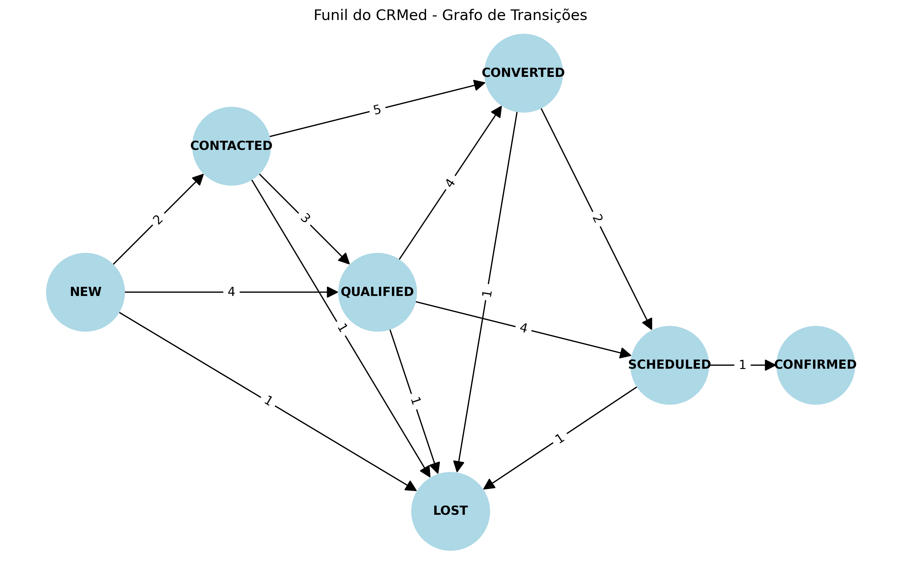

<h1 align="center">
   CRMed — Dynamic Programming
</h1>
<p align="center">Sistema inteligente de relacionamento e performance clínica para o Hospital São Rafael.</p>
<p align="center">
  <a href="https://github.com/GrupoMoskitto/CRMed-Python-Sprint3/actions/workflows/tests.yml"></a>&nbsp;
  <a href="https://github.com/GrupoMoskitto/CRMed-Python-Sprint3"></a>&nbsp;
  <a href="https://github.com/GrupoMoskitto/CRMed-Python-Sprint3"></a>
</p>

---

### Sobre

O **CRMed** é o cérebro operacional do **Hospital São Rafael** (especializado em cirurgias eletivas e plásticas). Este módulo implementa os conceitos de **Programação Dinâmica** (Recursão + Memoização) aplicados ao CRM.

**Funcionalidades implementadas:**

- **Verificação de Duplicidade** — Detecção recursiva de leads duplicados por CPF, e-mail, telefone ou nome
- **Memoização** — Cache para evitar comparações repetidas entre cadastros
- **Otimização de Agenda** — Algoritmo DP para melhor encaixe de procedimentos nos horários disponíveis

### Stack

| Camada | Tecnologia |
| --- | --- |
| **Linguagem** | Python 3.10+ |
| **Dados** | pandas |
| **Testes** | pytest |
| **CI/CD** | GitHub Actions |


### Quick Start

```bash
# Clone
git clone https://github.com/GrupoMoskitto/crmed-python-sprint3.git
cd crmed-python-sprint3

# Crie ambiente virtual
python -m venv venv
source venv/bin/activate  # Linux/Mac
# ou
venv\Scripts\activate  # Windows

# Instale dependências
pip install -r requirements.txt

# Execute a demo
python main.py

# Execute os testes
pytest tests/ -v
```

## Sprint 3 — Recursão e Memoização no CRM

**Objetivo:** Modelar o problema de duplicidade de leads e cadastros e otimizar a busca de combinações e verificações repetidas.  
Quando novos leads chegam ao sistema, eles podem já existir no banco de dados. O sistema deve verificar duplicidade com base em informações como: nome, telefone, e-mail e CPF. Implementar funções que façam essa validação e explorem combinações possíveis de comparação.

### Tarefas Implementadas

**Tarefa 1 — Verificação recursiva de duplicidade:** Criar uma função recursiva que percorra uma lista de cadastros e verifique se um novo lead já existe (2,5).
```python
from src.duplicated_check import verificar_duplicidade_recursiva

novo_lead = {"nome": "João Silva", "cpf": "123.456.789-00"}
cadastros = [...]

resultado = verificar_duplicidade_recursiva(novo_lead, cadastros)
# Retorna True se encontrar duplicata
```

**Tarefa 2 — Uso de memoização:** Aplicar memoização para evitar repetir comparações entre leads e cadastros já analisados (2,5).
```python
from src.duplicated_check import verificar_com_memo

resultado, comparacoes, cache = verificar_com_memo(novo_lead, cadastros)
# Usa cache para evitar recalcular comparações já feitas
```

**Tarefa 3 — Otimização de agenda com subproblemas:** Criar uma função recursiva para calcular o melhor encaixe de horários disponíveis de um médico em determinado dia, evitando recalcular os mesmos intervalos (2,5).
```python
from src.agenda_optimizer import calcular_melhor_encaixe

horarios = ["08:00", "08:30", "09:00", ...]
procedimentos = ["Abdominoplastia", "Mamoplastia", "Blefaroplastia"]

resultado = calcular_melhor_encaixe(horarios, procedimentos, PROCEDIMENTOS)
# Retorna melhor combinação usando programação dinâmica
```

---

## Sprint 4 — Grafos e Dijkstra no CRM

**Objetivo:** Modelar o fluxo do CRM como um grafo e encontrar o melhor caminho entre etapas do processo usando Dijkstra.

### Tarefas Implementadas

**Tarefa 1 — Representar o fluxo como grafo:** transformar o fluxo do CRM em um grafo direcionado. (2,5)  
O funil de CRM foi modelado em nós (`NEW`, `CONTACTED`, `QUALIFIED`, `CONVERTED`, `SCHEDULED`, `CONFIRMED` e `LOST`), sendo que as arestas indicam o custo (em horas de esforço da equipe).

<p align="center">
  
</p>

**Tarefa 2 — Implementar o algoritmo de Dijkstra:** Criar uma função que encontre o menor caminho entre Lead → Confirmação (2,5).  
O algoritmo foi implementado manualmente para traçar a rota matemática mais rápida e barata possível para conversão.

**Tarefa 3 — Interpretar o resultado:** Explicar qual foi o menor caminho encontrado. Qual o custo total e Por que esse fluxo é mais eficiente? (2,5)  
O caminho ótimo identificado foi **`NEW -> QUALIFIED -> SCHEDULED -> CONFIRMED`**, custando apenas **9 horas** de esforço. Esse fluxo ignora `CONTACTED` (frio) e `CONVERTED` (negociação prolongada), provando de forma matemática que uma estratégia de Inbound Marketing com agendamento self-service economiza o tempo da equipe.

> [!NOTE]  
> **Código em Python (Jupyter Notebook)**  
> A implementação dos grafos e do algoritmo de Dijkstra está disponível no arquivo abaixo. O GitHub o renderiza nativamente, permitindo visualizar o código e os resultados sem precisar configurar nada localmente.  
> [**Acessar `sprint4_grafos_dijkstra.ipynb`**](./sprint4_grafos_dijkstra.ipynb)

#### Como Executar o Jupyter Notebook Localmente
1. Certifique-se de estar no ambiente virtual do projeto (`venv`).
2. Instale as bibliotecas necessárias para a visualização dos grafos e execução do ambiente:
   ```bash
   pip install jupyter networkx matplotlib
   ```
3. Inicie o servidor Jupyter na raiz do projeto:
   ```bash
   jupyter notebook
   ```
4. Navegue até o arquivo `sprint4_grafos_dijkstra.ipynb` e execute as células sequencialmente (`Shift + Enter`).

### Dados

Os dados são carregados dinamicamente do arquivo CSV [`leads_2026-04-04.csv`](leads_2026-04-04.csv), contendo 58 leads do Hospital São Rafael.

| Campo | Descrição |
| --- | --- |
| **Origens** | Instagram, Facebook, TikTok, Site, Indicação |
| **Procedimentos** | Abdominoplastia, Mamoplastia, Blefaroplastia, Rinoplastia, etc. |
| **Status** | Novo, Contatado, Qualificado, Convertido, Perdido |

### Regras de Negócio

| RN | Descrição | Prioridade |
| --- | --- | --- |
| **RN01** | **Duplicidade Zero** — Proibido cadastrar pacientes com CPF, e-mail ou telefone duplicados | Crítica |

### Scripts

| Comando | Descrição |
| --- | --- |
| `python main.py` | Executa a demo com todas as funcionalidades |
| `pytest tests/ -v` | Executa todos os testes unitários |
| `pytest tests/ -v --cov=src` | Executa testes com coverage |

### CI/CD

O pipeline GitHub Actions executa automaticamente:

- **Testes** — Validação com pytest
- **Cobertura** — Relatório de coverage

> [!TIP]
> Acompanhe os resultados em [GitHub Actions](https://github.com/GrupoMoskitto/CRMed-Python-Sprint3/actions). Cada push mostra se os testes passaram e os logs de execução.

### Equipe

| Nome | GitHub | LinkedIn |
| --- | --- | --- |
| **Gabriel Couto Ribeiro** | [](https://github.com/rouri404) | [](https://www.linkedin.com/in/gabricouto/) |
| **Gabriel Kato Peres** | [](https://github.com/kato8088) | [](https://www.linkedin.com/in/gabrikato/) |
| **João Vitor de Matos** | [](https://github.com/joaomatosq) | [](https://www.linkedin.com/in/joaomatosq/) |
| **Marcelo Affonso Fonseca** | [](https://github.com/marcelo215) | [](https://www.linkedin.com/in/marcelo-affonso-fonseca-899682333/) |

---

<p align="center">
  Desenvolvido pelo <strong>Grupo Moskitto</strong> para o Challenge FIAP — Dynamic Programming.
</p>
